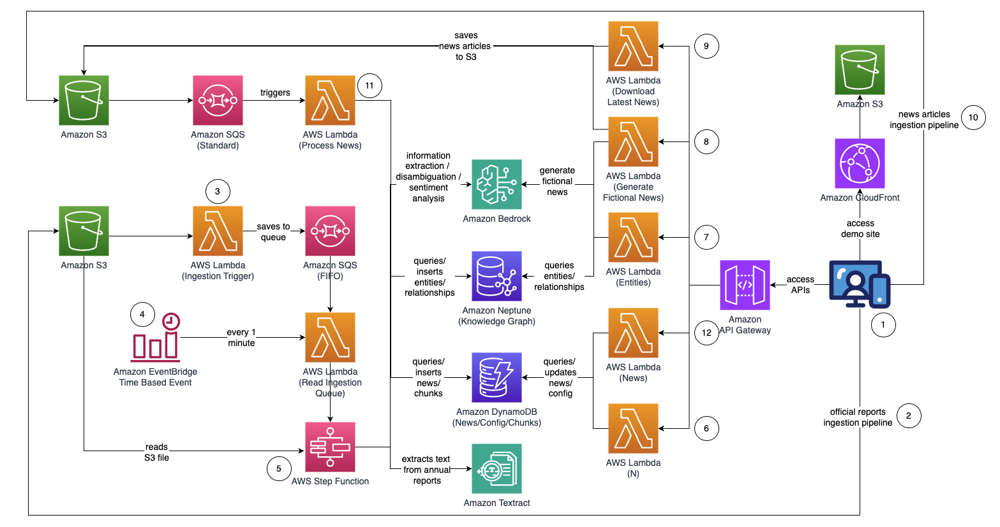
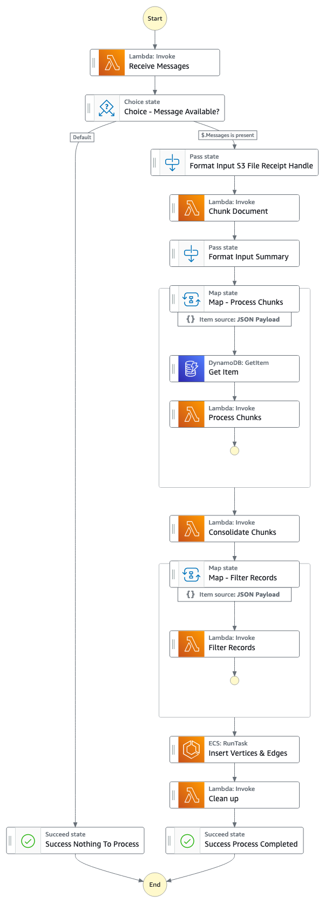
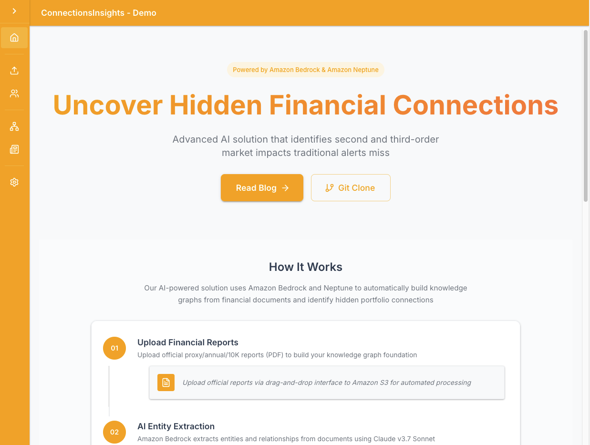
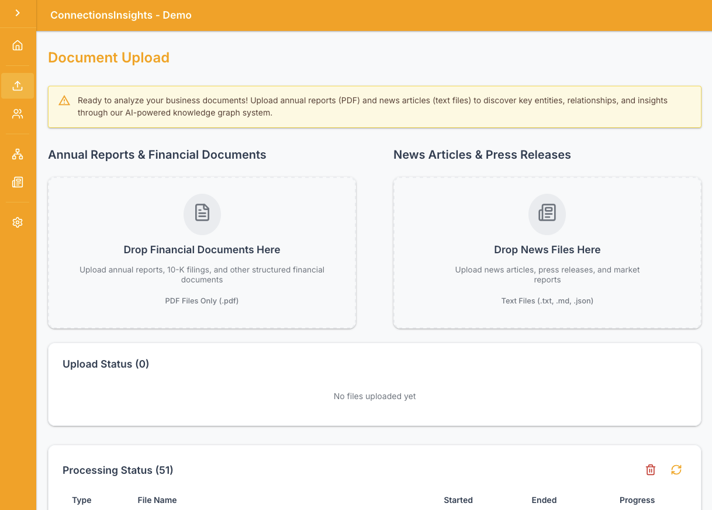
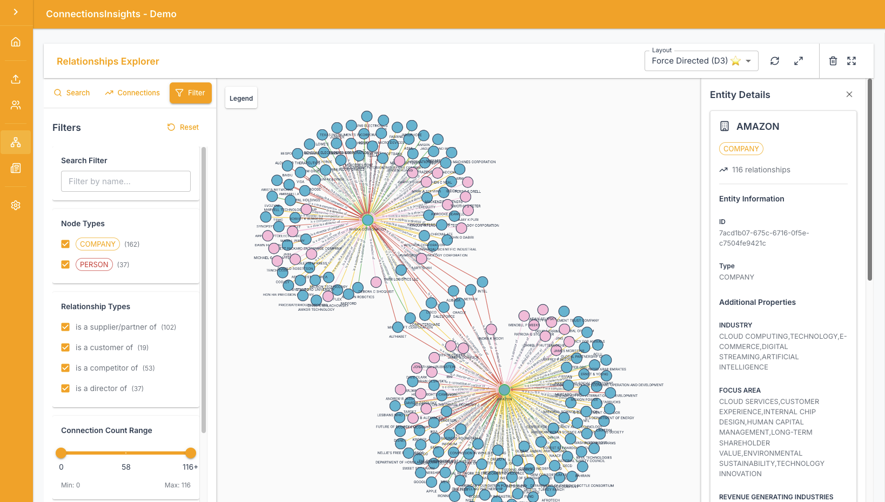

# Uncovering Hidden Connections in Unstructured Financial Data using Amazon Bedrock and Amazon Neptune

This repository contains code to deploy a prototype solution that demonstrates how Generative AI and knowledge graph can be combined to create a scalable, event-driven, serverless system to process unstructured data for financial services. This solution can help asset managers in your organization uncover hidden connections in their investment portfolios and provides a sample easy-to-use user interface to consume financial news and understand its connections to their investment portfolios.

## Business Use Case
Asset managers generally invest in large number of companies in their portfolios, and they need to be able to keep track of any news related to those companies because these news would help them stay ahead of market movements, identify investment opportunities, and better manage their investment portfolio.

Generally, news tracking can be done easily by setting up a simple keyword based news alert using the investee company name, but this becomes increasingly difficult when the news event does not impact the investee company directly.  For example the impact could be to a supplier of an investee company which would potentially disrupt the company's supply chain. Or the impact could be to a customer of a customer of your investee company.  If these companies have their revenues concentrated to a few key customers, this would potentially have a negative financial impact to your investment.

Such second or third-order order impact are difficult to identify and even harder to track.  With this automated solution, asset managers can build up a knowledge graph of the relationships surrounding their investment portfolio, and then make use of this knowledge to draw correlation & insights from latest news.

## Architecture


## Step Function Graph (from point #4)



## Solution flow (step by step)

### Getting Started

1. Access the React-based web application.
    * URL for the web application can be copied from [CloudFormation console - webapp stack](https://us-east-1.console.aws.amazon.com/cloudformation/home) output - "WebApplicationURL"
    * If needed, update the settings by clicking on the gear icon on the top right hand corner:
        * News API key (optional, for downloading live news) — obtain from [NewsAPI.org](https://newsapi.org/) after creating a free account

### Part 1: Building the Knowledge Graph (PDF Ingestion Pipeline)

2. Upload official proxy/annual/10k reports (.PDF) using the "Upload" function from the left menu in the web application.
    * The file uploads directly to S3 from your browser.
    * Note that the reports used should be officially published reports to minimize the inclusion of inaccurate data into your knowledge graph (as opposed to news/tabloids).
3. S3 event notification triggers an AWS Lambda function (`ingestion-trigger`) which sends the S3 bucket/file name to an Amazon SQS FIFO Queue.
    * The use of a FIFO queue ensures that report ingestion is performed sequentially to reduce the likelihood of introducing duplicate data into your knowledge graph.
4. An Amazon EventBridge time-based rule runs every minute to invoke an AWS Lambda function (`read-ingestion-queue`). The function retrieves the next available queue message and starts an AWS Step Function execution asynchronously.
5. A Step Function state machine executes through a series of tasks to process the uploaded document:
    * Tasks
        1. (`chunk-document`) Using Amazon Textract, extract text content from the PDF in S3 and split it into smaller text chunks. Store the chunks in Amazon DynamoDB. A processing status record is created in DynamoDB to track progress.
        2. (`process-chunks`) For each text chunk, use Anthropic Claude on Amazon Bedrock to extract entities (companies/people) and their relationships (customer/supplier/partner/competitor/director) to the main entity.
        3. (`consolidate-chunks`) Consolidate all extracted information across chunks.
        4. (`filter-records`) Use Amazon Bedrock to filter out noise and irrelevant entities (e.g. generic terms like "consumers").
        5. (`group-entities`) Group entities alphabetically and prepare them for graph insertion.
        6. (`insert-vertices-edges` — ECS Fargate) Use Amazon Bedrock to perform disambiguation by reasoning against existing entities in the knowledge graph. Insert new entities and relationships into Amazon Neptune.
        7. (`clean-up`) Delete the SQS queue message and the S3 file. Mark the processing status record as completed.
    * If any step fails, the `return-message` Lambda returns the SQS message to the queue for retry and marks the processing status as failed.
    * You can monitor ingestion progress in real time from the Processing Status panel in the web application.
    * Once this step completes, your knowledge graph is updated and ready to use.

### Part 2: Processing News Articles

6. Using the web application, specify the number of hops (default N=2) on the connection path to monitor.
    * Click on "Entities" on the left menu, and specify the value of "N Hops".
7. Using the web application, specify the list of entities to track.
    * Click on "Entities" on the left menu, search for the entities that you are interested in, and toggle the "Interested" switch to mark the corresponding entity as "Interested"/"Not Interested".
    * ***This is an important step, and must be done before any news articles are processed.***
8. To generate fictional news, go to "Settings" on the left menu, and click "Generate Sample News" to generate 10 sample financial news articles with random content.
    * Content is generated using Amazon Bedrock and is purely fictional.
9. To download actual news, go to "Settings" on the left menu, and click "Download Latest News" to download the top business news for today (powered by NewsAPI.org).
10. To upload your own news files (.TXT), use the "Upload" function from the left menu in the web application.
    * The file uploads directly to S3 from your browser.
    * You can also build integrations to your preferred news provider such as [AWS Data Exchange](https://aws.amazon.com/data-exchange/) or any 3rd party news provider to drop news articles directly into the S3 news bucket.
    * News data file content should be formatted as: `<date>{dd mmm yyyy}</date><title>{title}</title><text>{news content}</text><url>{url}</url>`
11. S3 event notification sends the S3 bucket/file name to an SQS standard queue, which triggers the `process-news` Lambda function.
    * Using Amazon Bedrock, the Lambda extracts entities mentioned in the news together with related information, relationships, and sentiment.
    * It then checks against the knowledge graph and uses Amazon Bedrock to perform disambiguation — identifying the corresponding entity in the graph.
    * Once the entity is located, it searches for and returns any connection paths to entities marked INTERESTED=YES within N hops.
    * A processing status record is created and updated throughout, tracking the progress of each news file.
12. The web application auto-refreshes every second to pull the latest set of processed news.

### Part 3: Additional Web Application Features

13. **Relationships Explorer** — Search for entities by name, view their immediate connections, and explore the knowledge graph interactively from the "Relationships" section in the left menu.
14. **Processing Status** — Monitor the ingestion and news processing pipeline in real time from the "Processing Status" section in the left menu. The status panel shows each file being processed, its progress percentage, and whether it completed successfully or failed.
15. **Reprocess News** — Trigger reprocessing of existing news articles (all or a specific one) from the news feed. This re-runs the entity extraction and connection path analysis against the current state of the knowledge graph.
16. **Purge News** — Delete all processed news records from the "Settings" section in the left menu. This is useful for resetting the news feed during demos.
17. **Purge Entities** — Delete all entities and relationships from the knowledge graph from the "Settings" section in the left menu. This is a destructive operation intended for resetting the graph during demos.

#### React Web Application - Home


#### React Web Application - Upload


#### React Web Application - Graph


## API Endpoints Summary

| Method | Endpoint | Description |
|--------|----------|-------------|
| GET | `/entity` | List all entities in the knowledge graph |
| POST | `/entity` | Update an entity's INTERESTED flag |
| GET | `/relationships` | Search entities or get entity relationship details |
| GET/POST | `/n` | Get or set the number of hops (N) |
| GET | `/news` | Retrieve all processed news articles |
| GET | `/reprocessnews` | Reprocess all or a specific news article |
| GET | `/generateNews` | Asynchronously generate sample fictional news |
| GET | `/downloadNews` | Asynchronously download latest news from NewsAPI.org |
| POST | `/presigned-url-pdf` | Get a presigned S3 URL to upload a PDF report |
| POST | `/presigned-url-news` | Get a presigned S3 URL to upload a news file |
| GET/DELETE | `/processing-status` | View or clear processing status records |
| DELETE | `/purge-news` | Delete all processed news from DynamoDB |
| DELETE | `/purge-entities` | Delete all entities and relationships from Neptune |

## Lambda Functions Summary

### API Lambdas
| Function | Runtime | Description |
|----------|---------|-------------|
| `api-entities` | Docker (Python) | GET/POST entity list and INTERESTED flag |
| `api-relationships` | Docker (Python) | Search entities and explore relationships |
| `api-n` | Python 3.13 | Get/set the N hops value |
| `api-news` | Python 3.13 | Retrieve processed news articles |
| `api-generate-news` | Docker (Python) | Generate fictional news via Bedrock |
| `api-download-news` | Docker (Python) | Download news from NewsAPI.org |
| `api-trigger-download-news` | Python 3.13 | Async trigger for download-news Lambda |
| `api-presigned-url-pdf` | Python 3.13 | Generate presigned URL for PDF upload |
| `api-presigned-url-news` | Python 3.13 | Generate presigned URL for news upload |
| `api-processing-status` | Python 3.13 | View/clear processing status records |
| `api-purge-news` | Python 3.13 | Delete all news records from DynamoDB |
| `api-purge-entities` | Python 3.13 | Delete all vertices/edges from Neptune |
| `reprocess-news` | Python 3.13 | Requeue news articles for reprocessing |

### S3 Pipeline Lambdas
| Function | Runtime | Description |
|----------|---------|-------------|
| `s3_pipeline-ingestion-trigger` | Python 3.13 | S3 event → SQS FIFO (PDF ingestion) |
| `s3_pipeline-read-ingestion-queue` | Python 3.13 | EventBridge → reads SQS → starts Step Function |
| `s3_pipeline-process_news` | Docker (Python) | SQS trigger → processes news article via Bedrock + Neptune |

### Step Function Lambdas
| Function | Runtime | Description |
|----------|---------|-------------|
| `step_function-receive_messages` | Python 3.13 | Receive SQS messages |
| `step_function-chunk_doc` | Docker (Python) | Textract PDF → DynamoDB chunks |
| `step_function-process-chunks` | Python 3.13 | Extract entities per chunk via Bedrock |
| `step_function-consolidate-chunks` | Python 3.13 | Merge chunk results |
| `step_function-filter_records` | Python 3.13 | Filter noise via Bedrock |
| `step_function-group_entities` | Python 3.13 | Group entities + create main entity in Neptune |
| `insert-vertices-edges` | ECS Fargate | Disambiguate + insert all entities/relationships into Neptune |
| `step_function-clean_up` | Python 3.13 | Delete SQS message + S3 file, mark processing complete |
| `step_function-return_message` | Python 3.13 | Return SQS message to queue on failure, mark processing failed |

# Deployment Instructions
This repository provides a CDK application that will deploy the entire prototype solution over two CDK stacks:
1) main application stack ("main stack") which can be deployed to any region (e.g. us-east-1, us-west-2) that has the required services and Amazon Bedrock models.
2) web application stack ("webapp stack") that can only be deployed to **us-east-1** as it requires AWS WAF.

You may deploy the two stacks into different regions, or into the same region (i.e. us-east-1).


## AWS services used
- Amazon Bedrock (Anthropic Claude Sonnet 4.6)
- Amazon Neptune (Serverless)
- Amazon Textract
- Amazon DynamoDB
- AWS Step Functions
- AWS Lambda
- Amazon Elastic Container Service (ECS Fargate)
- Amazon Simple Queue Service (SQS)
- Amazon EventBridge
- Amazon Simple Storage Service (S3)
- Amazon CloudFront
- AWS WAF
- Amazon VPC
- Amazon API Gateway
- AWS Identity and Access Management


## Pre-requisites
- Python — You will require Python 3 and above.
- Node — You will require v18.0.0 and above.
- Docker — You will require v24.0.0 and above with Docker Buildx, and have the docker daemon running.
- uv — Python package manager used for this project. Install via `pip install uv` or see [uv installation guide](https://docs.astral.sh/uv/getting-started/installation/).


## Deploy
To deploy the solution (it takes approximately 30 mins):

```
$ ./deploy.sh <aws region to deploy main application stack>
```


## Clean up

To destroy the solution:

```
$ ./destroy.sh <aws region where main application stack was deployed>
```
If you encounter deletion failure due to S3 buckets not empty, this could be due to access log files written to the S3 buckets after they were emptied as part of the cdk destroy process.  If this happens, just empty those buckets and re-run the clean up command again.
